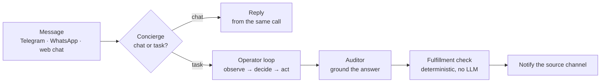
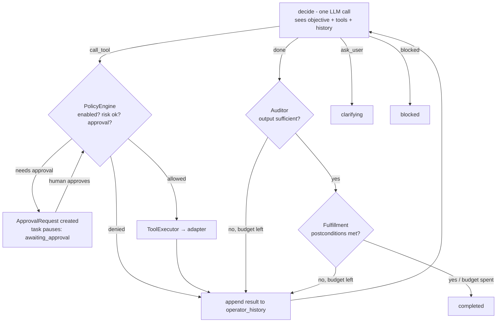
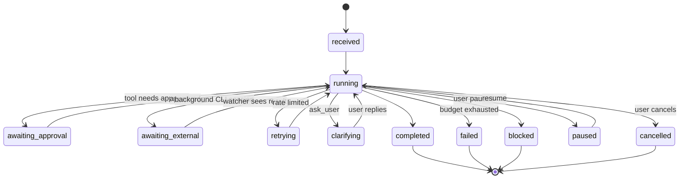
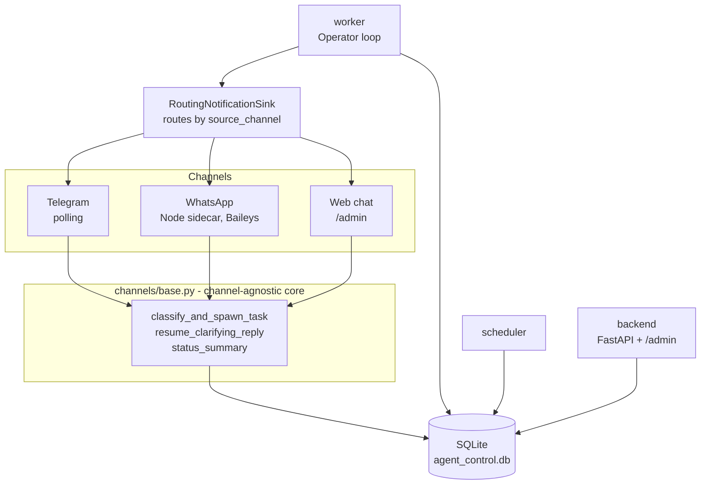

# Architecture

How a message becomes an answer. For *why* it's built this way, see [HISTORY.md](HISTORY.md);
for what it can do, [CAPABILITIES.md](CAPABILITIES.md).

## The mental model: three agents, many tools

| Agent | Calls | Job |
|---|---|---|
| **Concierge** | 1 LLM call | Is this chat or a task? If chat, the reply comes back in that *same* call. |
| **Operator** | 1 LLM call per step | The execution loop: observe → decide → act, until done. |
| **Auditor** | 1 LLM call | Does the raw tool output actually answer the question? Rewrites the final answer so it's grounded. |

A **deterministic** fulfillment check (no LLM) runs last.



## The Operator loop

One tick per poll. Every tool call passes the policy gate - this is where approvals happen.



The key property: **a gap never triggers a replan.** It's appended to `operator_history`, and the
next `decide()` sees it in context and chooses what to do. There is no separate recovery planner.

### Decisions `decide()` can return

`call_tool` · `done` · `ask_user` · `blocked`, plus two narrow extras:

- **`call_tools_parallel`** - 2+ *independent* calls via `asyncio.gather`. No approval, retry, or
  background-wait support; a call needing one fails cleanly inside the batch while the rest run.
  Costs one step-budget slot per call.
- **`delegate`** - a self-contained sub-task in an isolated inner loop with its own empty history
  and its own budget (`DELEGATE_MAX_STEPS = 6`). Only a one-line summary returns to the parent.
  Cannot recurse, request approval, wait on background work, or ask the user.

Neither is a general replacement for `call_tool`; the Operator prompt says so directly.

## Task states



The worker claims `received`, `interpreting`, `planned`, `running`, and `retrying`, and routes
them all through the Operator loop. `awaiting_approval` is deliberately **not** claimable - a
pending approval would otherwise monopolize the single worker while a human decides. A decision
(or a timed-out expiry - see [sweep_expired_approvals](#gap-handling-budgets)) flips the task back
to `running` so the next poll picks it up. `interpreting` and `planned` are pre-P3 leftovers
nothing transitions into anymore - kept claimable only so an old stuck task
isn't stranded. It skips `paused`, `cancelled`, `completed`, `failed`, and `blocked`.

## Gap-handling budgets

Counters live in task `metadata`. On exhaustion the loop either completes anyway (flagging the
gap) or fails.

| Counter | Max | Triggered by | On exhaustion |
|---|---|---|---|
| `operator_max_steps` | 12 (config) | Every `call_tool`. Audit/fulfillment gap entries do **not** count. | Task **failed** |
| `operator_audit_gap_count` | 2 | Auditor judges output insufficient after `done` | Completes with the Operator's own answer |
| `operator_fulfillment_gap_count` | 2 | Postcondition check fails after `done` | Completes with `metadata.fulfillment_gap` set |
| `clarify_count` | 2 | `ask_user`, or usage-limit backoff | Task **failed** |

A pending approval isn't in this table because it isn't a step budget - it's a wall-clock deadline
(`approval_policy.default_timeout_seconds`). `orchestration/signals.py::sweep_expired_approvals()`
runs every worker poll tick: it expires the stale approval row, then requeues the task to `running`
so the Operator loop's normal path transitions it to **blocked** (notified) instead of it sitting
in `awaiting_approval` forever - the risk being a Telegram/WhatsApp-only operator who never opens
the admin console to trigger the older, console-only sweep.

## When the Auditor runs

Only when a **content tool** was called - one that returns human-readable content:
`browser.open`, `browser.control`, `code.interpreter`, `filesystem.manage`, `document.manage`,
`computer.use`, `http.request`, `mcp.client`, `delegate` (`AuditorService.CONTENT_TOOLS`).

Tasks that never touch one (status checks, scheduling, delivery-only) skip it and complete on the
Operator's own `final_answer` plus the fulfillment check.

Two deliberate edge cases:
- `artifact.deliver` is **excluded** - the loop scans backward past a delivery step to the tool
  that produced the content, so *that* gets audited rather than a delivery receipt.
- `delegate` is **included** - a sub-task's tool calls update the parent's output, so a `done`
  right after a `delegate` would otherwise skip the gate on a technicality.

## Processes and channels



Only **intake** (polling + allowlist) and **notify** (formatting + delivery) are per-channel;
everything from classification onward is shared. `RoutingNotificationSink` picks the notifier
from `task.metadata["source_channel"]`.

WhatsApp is off by default, plain-text only (no buttons/voice/file delivery), and talks to a
Node.js sidecar over loopback HTTP with a per-run shared secret. See
[LOCAL_SETUP.md](LOCAL_SETUP.md#5-link-whatsapp-optional).

## Key components

| Component | File | Role |
|---|---|---|
| Concierge | `llm/classifier.py` | Classify *and* compose the chat reply in one call |
| Channel intake | `channels/telegram.py`, `channels/whatsapp.py` | Allowlist, command routing, task creation |
| Channel core | `channels/base.py` | The shared, channel-agnostic path |
| Conversation memory | `channels/memory.py` | Rolling per-chat summary; own LLM call with heuristic fallback |
| Operator | `orchestration/operator.py` + `worker.py` | `decide()` plus the observe/gate/act/record tick |
| Tool registry | `tools/registry.py` + `tools/spec.py` | Each tool self-registers via `register(deps, definitions, adapters)` |
| Tool executor | `orchestration/executor.py` | Policy enforcement, input/output contract validation, dispatch |
| Policy engine | `policy/engine.py` | Capability enabled? scope? risk ceiling? approval? |
| Auditor | `orchestration/auditor.py` | Sufficiency check + grounded answer |
| Fulfillment | `orchestration/fulfillment.py` | Deterministic postconditions: the Concierge's declared `expected_postconditions` when present, else inferred from objective text |
| Notifications | `channels/task_notify.py` | `format_task_message()`, shared across channels |
| Persona | `persona.py` | One global preference doc injected into every Operator prompt |
| Knowledge base | `knowledge_base.py` | Local keyword-overlap search over your documents - not embeddings |
| Logging | `logging_setup.py` | structlog → JSON, `task_id` bound as a contextvar |
| LLM provider catalog | `llm/catalog.py` | The 13 providers the console offers, as data - adding one is a row, not a code path |
| Anthropic provider | `llm/anthropic_provider.py` | Native, since Anthropic's API is not OpenAI-compatible; omits `temperature` on models that reject it |
| Hardware probe | `llm/hardware.py` | Asks LocalDeploy for free VRAM first, falls back to nvidia-smi; drives each local preset's fit verdict |
| Channel catalog | `channels/catalog.py` | Every way to reach YBM with an honest, per-request-resolved connection status |
| User-facing errors | `error_text.py` | `describe_exception()` for logs, `explain_for_user()` for a person - never the same string |

## Tools

`tools/registry.py` is the single source of truth. Currently registered:

`adapter.factory` · `artifact.deliver` · `browser.control` · `browser.open` · `code.interpreter` ·
`coding.agent` · `computer.use` · `document.manage` · `filesystem.manage` · `http.request` ·
`knowledge.search` · `mcp.client` · `memory.manage` · `persona.manage` · `schedule.manage` ·
`skills.use` · `task.status` · `tts.synthesize` · `vscode.copilot_terminal` ·
`vscode.terminal_command` · `workspace.manage`

Every tool carries typed input/output contracts. The executor validates input **before** policy
and adapter execution, and validates output before recording success - bad payloads surface as
`validation_failed` rather than silently misbehaving.

A missing tool routes to `adapter.factory`, which writes a reviewable proposal under
`.agent_control/adapters`. Proposals are never imported or executed until reviewed, tested, and
registered.

## Prompts

```
prompts/
├── base/                        ← system prompts
│   ├── concierge_system.md      ← agent
│   ├── operator_system.md       ← agent
│   ├── auditor_system.md        ← agent
│   ├── telegram_gateway_system.md   ← fallback chat responder
│   ├── conversation_memory_system.md
│   └── *_system.md              ← tool-internal, not agents
└── tasks/                       ← user templates, ${variable} substitution
```

Three agent prompts. Everything else is a tool's own internal prompt, not a fourth agent.

## Config and secrets

- `config/config.yaml` - all non-secret runtime config: profiles, adapters, access modes,
  allowlists, ports, `operator.max_steps`. Bootstrapped from `config.example.yaml`.
- `.env` - secrets only: `TELEGRAM_BOT_TOKEN`, `OPENAI_API_KEY`, `VSCODE_BRIDGE_TOKEN`,
  `AGENT_ADMIN_TOKEN`, `AGENT_SECRET_VAULT_KEY`, `YBM_LOCALDEPLOY_ROOT`.

> A YAML-set list **replaces** the code default rather than merging with it. Pinning a list
> (e.g. `blocked_imports`) means you silently stop inheriting later additions to that default.

## Debugging a task

```bash
ybm trace-task <task_id>          # full post-mortem; --json for raw
ybm logs worker -f                # follow a service log
```

`trace-task` reads the DB directly - no running backend needed. The same data renders at
`/admin/tasks/:taskId`. Structured logs are at `.agent_control/logs/<service>.jsonl`, one JSON
object per line, secrets redacted, `task_id` on every line written during that task.

> On Windows, `scripts\ybm.ps1` uses **two-word** subcommands (`ybm.ps1 trace <id>`) where the
> cross-platform `ybm` CLI uses **hyphenated** ones (`ybm trace-task <id>`). Both are supported.

## Known gaps

The maintained limitation list is [GAPS.md](GAPS.md). In architectural terms,
the important boundaries are: YBM is a single-trusted-operator local system;
untrusted tool and document content can still attempt prompt injection; the
Auditor checks grounding more reliably than numerical plausibility; and live
model, voice, Telegram, and WhatsApp flows sit outside deterministic CI.

[HISTORY.md](HISTORY.md) records why earlier gaps were closed or deliberately
deferred. Archived plans must not be used as evidence that behavior exists.
  whether a computed number is *right* is not.
- **The live E2E suite hasn't been re-run** since being trimmed to 11 cases; the last pass-rate
  measurement predates the current architecture. The deterministic scenario tier is the
  trustworthy signal meanwhile.
- **Status requests cost two LLM calls.** The old LLM-free keyword shortcut was deliberately not
  rebuilt - it was brittle and silently misroutable.
