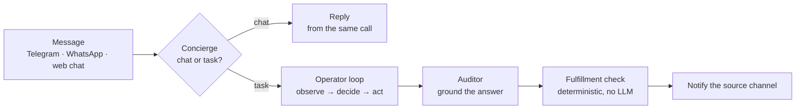
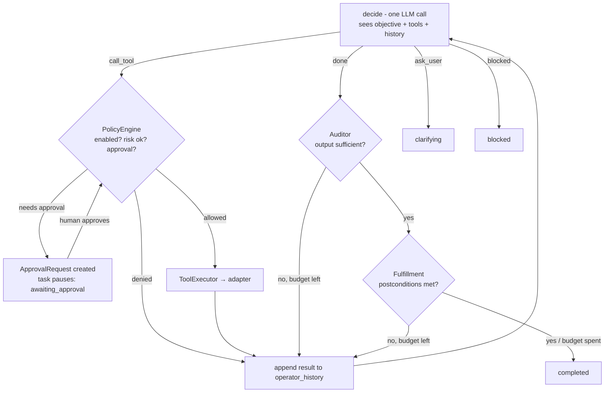
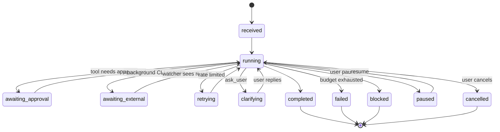
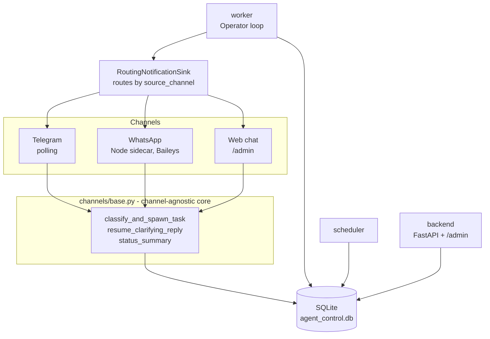

# Architecture

How a message becomes an answer. For *why* it is built this way, see the decision record in
[archive/HISTORY.md](archive/HISTORY.md); for what it can do, [CAPABILITIES.md](CAPABILITIES.md); for how
to use it, [USING.md](USING.md).

## The mental model: three roles, many tools

| Role | Console wording | Calls | Job |
|---|---|---|---|
| **Concierge** | "understands requests" | 1 LLM call | Is this chat or a task? If chat, the reply comes back in that *same* call. May also ask a clarifying question. |
| **Operator** | "does the work" | 1 LLM call per step | The execution loop: observe, decide, act, until done. |
| **Auditor** | "checks the result" | 1 LLM call | Does the raw tool output actually answer the question? Rewrites the final answer so it is grounded. |

A **deterministic** fulfillment check (no LLM) runs last.

The role names are internal. They appear in `schemas.py` (`OperatorDecision`, `OperatorAction`) and in
the recorded scenario fixtures, so renaming them would be a large diff for no user benefit; the console
simply uses the plain-language wording above. All three roles share one model profile by default.
`llm.major_profile` can route heavier work to a different profile, and `llm.fallback_profile` is used
when the primary endpoint is unreachable: connection errors, timeouts, or HTTP 5xx only. A 4xx or a bad
structured response is deliberately *not* failed over, because it would fail the same way against the
fallback and switching models would hide the real problem (`llm/providers.py::_is_unavailability`).


```mermaid
flowchart LR
    M["Message<br/>Telegram · WhatsApp · web chat"] --> C{"Concierge<br/>chat or task?"}
    C -->|chat| R["Reply<br/>from the same call"]
    C -->|task| O["Operator loop<br/>observe → decide → act"]
    O --> A["Auditor<br/>ground the answer"]
    A --> F["Fulfillment check<br/>deterministic, no LLM"]
    F --> N["Notify the source channel"]
```

## The Operator loop

One tick per poll. Every tool call passes the policy gate - this is where approvals happen.


```mermaid
flowchart TD
    D["decide - one LLM call<br/>sees objective + tools + history"]
    D -->|call_tool| P{"PolicyEngine<br/>enabled? risk ok? approval?"}
    P -->|denied| H
    P -->|needs approval| AP["ApprovalRequest created<br/>task pauses: awaiting_approval"]
    AP -->|human approves| P
    P -->|allowed| X["ToolExecutor → adapter"]
    X --> H["append result to operator_history"]
    H --> D
    D -->|done| AUD{"Auditor<br/>output sufficient?"}
    AUD -->|no, budget left| H
    AUD -->|yes| FUL{"Fulfillment<br/>postconditions met?"}
    FUL -->|no, budget left| H
    FUL -->|yes / budget spent| DONE["completed"]
    D -->|ask_user| CL["clarifying"]
    D -->|blocked| BL["blocked"]
```

The key property: **a gap never triggers a replan.** It is appended to `operator_history`, and the
next `decide()` sees it in context and chooses what to do. There is no separate recovery planner.

### Decisions `decide()` can return

`call_tool` · `done` · `ask_user` · `blocked`, plus two narrow extras:

- **`call_tools_parallel`** - 2+ *independent* calls via `asyncio.gather`. The batch is pre-flighted
  through the policy engine before anything runs. If any call needs approval, the user gets **one**
  approval listing every such call and nothing executes until they answer, so organising 128 files is
  one question, not 128. Authority does not widen: each listed call has its own approval bound
  byte-for-byte to its exact request, and the batch decision only cascades to those children; a call
  the human never saw still has to ask. There is no retry or background-wait support inside a batch (a
  call that starts a background session fails cleanly while the rest run). Costs one step-budget slot
  per call.
- **`delegate`** - a self-contained sub-task in an isolated inner loop with its own empty history and
  its own budget (`DELEGATE_MAX_STEPS = 6`). Only a one-line summary returns to the parent. Cannot
  recurse, request approval, wait on background work, or ask the user.

Neither is a general replacement for `call_tool`; the Operator prompt says so directly.

## Task states


```mermaid
stateDiagram-v2
    [*] --> received
    received --> running
    running --> awaiting_approval: tool needs approval
    awaiting_approval --> running: approved
    running --> awaiting_external: background CLI session
    awaiting_external --> running: watcher sees result
    running --> retrying: rate limited
    retrying --> running
    running --> clarifying: ask_user
    clarifying --> running: user replies
    running --> completed
    running --> failed: budget exhausted
    running --> blocked
    running --> paused: user pauses
    paused --> running: resume
    running --> cancelled: user cancels
    completed --> [*]
    failed --> [*]
    blocked --> [*]
    cancelled --> [*]
```

The worker claims `received`, `interpreting`, `planned`, `running`, and `retrying`, and routes them
all through the Operator loop. `awaiting_approval` is deliberately **not** claimable - a pending
approval would otherwise monopolize the single worker while a human decides. A decision (or a
timed-out expiry - see [Gap-handling budgets](#gap-handling-budgets)) flips the task back to `running`
so the next poll picks it up. `interpreting` and `planned` are pre-P3 leftovers nothing transitions
into any more, kept claimable only so an old stuck task is not stranded. The worker skips `paused`,
`cancelled`, `completed`, `failed`, and `blocked`.

**Surviving a restart.** `operator_in_flight` is written before a tool call is dispatched and cleared
once its result is recorded, so a dead worker leaves evidence of which call was in the air. On startup
`reconcile_orphaned_tasks` resumes a task that was still running instead of failing it: nothing in
flight resumes, a read in flight resumes (re-running it is harmless), and a *write* in flight moves the
task to `clarifying` with a question naming the tool, because retrying can do a thing twice and
skipping can leave the job half done. Pause, resume, and cancel are checked at the top of every step,
and a restart never resurrects a paused or cancelled task.

## Gap-handling budgets

Counters live in task `metadata`. On exhaustion the loop either completes anyway (flagging the gap) or
fails.

| Counter | Max | Triggered by | On exhaustion |
|---|---|---|---|
| `operator_max_steps` | 12 (config) | Every `call_tool`. Audit/fulfillment gap entries do **not** count. | Task **failed** |
| `operator_audit_gap_count` | 2 | Auditor judges output insufficient after `done` | Completes with the Operator's own answer |
| `operator_fulfillment_gap_count` | 2 | Postcondition check fails after `done` | Completes with `metadata.fulfillment_gap` set |
| `clarify_count` | 2 | `ask_user`, or usage-limit backoff | Task **failed** |

A pending approval is not in this table because it is not a step budget - it is a wall-clock deadline
(`approval_policy.default_timeout_seconds`). `orchestration/signals.py::sweep_expired_approvals()` runs
every worker poll tick: it expires the stale approval row, then requeues the task to `running` so the
Operator loop's normal path transitions it to **blocked** (notified) instead of leaving it in
`awaiting_approval` forever - the risk being a Telegram/WhatsApp-only operator who never opens the
admin console to trigger the older, console-only sweep.

## When the Auditor runs

Only when a **content tool** was called - one that returns human-readable content: `browser.open`,
`browser.control`, `code.interpreter`, `filesystem.manage`, `document.manage`, `computer.use`,
`http.request`, `mcp.client`, `delegate` (`CONTENT_TOOLS` in `orchestration/auditor.py`).

Tasks that never touch one (status checks, scheduling, delivery-only) skip it and complete on the
Operator's own `final_answer` plus the fulfillment check.

Two deliberate edge cases:

- `artifact.deliver` is **excluded** - the loop scans backward past a delivery step to the tool that
  produced the content, so *that* gets audited rather than a delivery receipt.
- `delegate` is **included** - a sub-task's tool calls update the parent's output, so a `done` right
  after a `delegate` would otherwise skip the gate on a technicality.

## Processes and channels


```mermaid
flowchart TD
    subgraph ch["Channels"]
        TG["Telegram<br/>polling"]
        WA["WhatsApp<br/>Node sidecar, Baileys"]
        WEB["Web chat<br/>/admin"]
    end
    subgraph core["channels/base.py - channel-agnostic core"]
        CORE["classify_and_spawn_task<br/>resume_clarifying_reply<br/>status_summary"]
    end
    TG --> CORE
    WA --> CORE
    WEB --> CORE
    CORE --> DB[("SQLite<br/>agent_control.db")]
    W["worker<br/>Operator loop"] --> DB
    S["scheduler"] --> DB
    BE["backend<br/>FastAPI + /admin"] --> DB
    W --> NOTIF["RoutingNotificationSink<br/>routes by source_channel"]
    NOTIF --> TG
    NOTIF --> WA
    NOTIF --> WEB
```

Only **intake** (polling + allowlist) and **notify** (formatting + delivery) are per-channel;
everything from classification onward is shared. `RoutingNotificationSink` picks the notifier from
`task.metadata["source_channel"]`.

WhatsApp is off by default, plain-text only (no buttons, voice, or file delivery), and talks to a Node.js
sidecar over loopback HTTP with a per-run shared secret. Setup is in
[INSTALL.md](INSTALL.md#link-whatsapp).

### Staying in sync with the config

The worker builds its policy, tools, and model client from `config/config.yaml` and `.env`, and
`WorkerRuntimeReloader` (`cli.py`) fingerprints those two files each poll. When either changes, the
running worker is reconfigured in place (`TaskWorker.reconfigure()`), so access, folders, and the model
chosen in the console apply to the next task with no restart. Telegram and WhatsApp intake build their
model clients once at startup; see [ROADMAP.md](ROADMAP.md#known-limits).

### Admin sign-in

The admin token lives in `.env` and is generated on first start. The launcher opens the console with a
one-time `?token=` link. The console strips the token from the address bar, keeps it only in that
tab's session storage (never `localStorage`), and exchanges it (`POST /admin/api/session`) for an
`HttpOnly`, `SameSite=Strict` cookie that holds an HMAC of the token rather than the token itself. That
cookie is what keeps a later visit, a bookmark, or the tray icon signed in. `ybm admin-url` prints a
fresh signed-in link at any time, and the same-origin check on state-changing requests still applies.

## Key components

| Component | File | Role |
|---|---|---|
| Concierge | `llm/classifier.py` | Classify *and* compose the chat reply in one call |
| Channel intake | `channels/telegram.py`, `channels/whatsapp.py` | Allowlist, command routing, task creation |
| Channel core | `channels/base.py` | The shared, channel-agnostic path |
| Conversation memory | `channels/memory.py` | Rolling per-chat summary; own LLM call with heuristic fallback |
| Operator | `orchestration/operator.py` + `worker.py` | `decide()` plus the observe/gate/act/record tick |
| Tool registry | `tools/registry.py` + `tools/spec.py` | Each tool self-registers via `register(deps, definitions, adapters)` |
| Tool executor | `orchestration/executor.py` | Policy enforcement, input/output contract validation, dispatch |
| Policy engine | `policy/engine.py` | Capability enabled? scope? risk ceiling? approval? |
| Blocked-access hints | `policy/access_hints.py` | Turns a denied call into "what to switch on", surfaced as a card in chat |
| Auditor | `orchestration/auditor.py` | Sufficiency check + grounded answer |
| Fulfillment | `orchestration/fulfillment.py` | Deterministic postconditions: the Concierge's declared `expected_postconditions` when present, else inferred from objective text |
| Notifications | `channels/task_notify.py` | `format_task_message()`, shared across channels |
| Persona | `persona.py` | One global preference doc injected into every Operator prompt |
| Knowledge base | `knowledge_base.py` | Local keyword-overlap search over your documents - not embeddings |
| Work folders | `work_folders.py` | Suggests and validates the folders a person can grant, and writes the matching access policy |
| Model auto-detect | `llm/autodetect.py` | First-run model choice from what is already on the machine; never calls a paid API |
| LLM call log | `llm/call_log.py` | Records the Concierge's call against the task it led to, so receipts include it |
| LLM provider catalog | `llm/catalog.py` | The 12 named providers plus a custom OpenAI-compatible endpoint, as data - adding one is a row, not a code path |
| Anthropic provider | `llm/anthropic_provider.py` | Native, since Anthropic's API is not OpenAI-compatible; omits `temperature` on models that reject it |
| Hardware probe | `llm/hardware.py` | Asks LocalDeploy for free VRAM first, falls back to nvidia-smi; drives each local preset's fit verdict |
| Channel catalog | `channels/catalog.py` | Every way to reach YBM with an honest, per-request-resolved connection status |
| User-facing errors | `error_text.py` | `describe_exception()` for logs, `explain_for_user()` for a person - never the same string |
| Logging | `logging_setup.py` | structlog to JSON, `task_id` bound as a contextvar |

## Tools

`tools/registry.py` is the single source of truth. Currently registered:

`adapter.factory` · `artifact.deliver` · `browser.control` · `browser.open` · `code.interpreter` ·
`coding.agent` · `computer.use` · `dependencies.install` · `document.manage` · `filesystem.manage` ·
`http.request` · `knowledge.search` · `mcp.client` · `memory.manage` · `persona.manage` ·
`schedule.manage` · `skills.use` · `task.status` · `tts.synthesize` · `vscode.copilot_terminal` ·
`vscode.terminal_command` · `web.search` · `workspace.manage`

Every tool carries typed input/output contracts. The executor validates input **before** policy and
adapter execution, and validates output before recording success - bad payloads surface as
`validation_failed` rather than silently misbehaving. A tool's capability can differ per operation
(`ToolDefinition.operation_capabilities`), so `filesystem.manage` looking at a folder needs only
`filesystem.read` while moving a file needs `filesystem.write`; the executor refuses a call that
substitutes a different capability from the one the tool declares for that operation.

A missing tool routes to `adapter.factory`, which writes a reviewable proposal under
`.agent_control/adapters`. Proposals are never imported or executed until reviewed, tested, and
registered.

## Prompts

```
prompts/
├── base/                        <- system prompts
│   ├── concierge_system.md      <- role
│   ├── operator_system.md       <- role
│   ├── auditor_system.md        <- role
│   ├── telegram_gateway_system.md   <- fallback chat responder
│   ├── conversation_memory_system.md
│   └── *_system.md              <- tool-internal, not roles
└── tasks/                       <- user templates, ${variable} substitution
```

Three role prompts. Everything else is a tool's own internal prompt, not a fourth role.

## Config and secrets

- `config/config.yaml` - all non-secret runtime config: profiles, adapters, access modes, allowlists,
  ports, `operator.max_steps`. Bootstrapped from `config.example.yaml`, which ships no model
  (`llm.default_profile` is empty until first-run auto-detect or the wizard picks one).
- `.env` - secrets only: `TELEGRAM_BOT_TOKEN`, provider API keys such as `OPENAI_API_KEY`,
  `VSCODE_BRIDGE_TOKEN`, `AGENT_ADMIN_TOKEN`, `AGENT_SECRET_VAULT_KEY`, `YBM_LOCALDEPLOY_ROOT`. The
  admin token and vault key are generated automatically.

> A YAML-set list **replaces** the code default rather than merging with it. Pinning a list (for
> example `blocked_imports`) means you silently stop inheriting later additions to that default.

## Debugging a task

```bash
ybm trace-task <task_id>          # full post-mortem; --json for raw
ybm logs worker -f                # follow a service log
```

`trace-task` reads the DB directly - no running backend needed. The same data renders at
`/admin/tasks/:taskId`. Structured logs are at `.agent_control/logs/<service>.jsonl`, one JSON object per
line, secrets redacted, `task_id` on every line written during that task.

> On Windows, `scripts\ybm.ps1` uses **two-word** subcommands (`ybm.ps1 trace <id>`) where the
> cross-platform `ybm` CLI uses **hyphenated** ones (`ybm trace-task <id>`). Both are supported.

## Boundaries

The maintained list of limitations is under [Known limits in the roadmap](ROADMAP.md#known-limits). In
architectural terms the important boundaries are: YBM is a single-trusted-operator local system;
untrusted tool and document content can still attempt prompt injection; the Auditor checks grounding
more reliably than numerical plausibility; and live model, voice, Telegram, and WhatsApp flows sit
outside deterministic CI. The [threat model](THREAT_MODEL.md) covers the security side. Archived plans
under `docs/archive/` must not be used as evidence that behavior exists.
