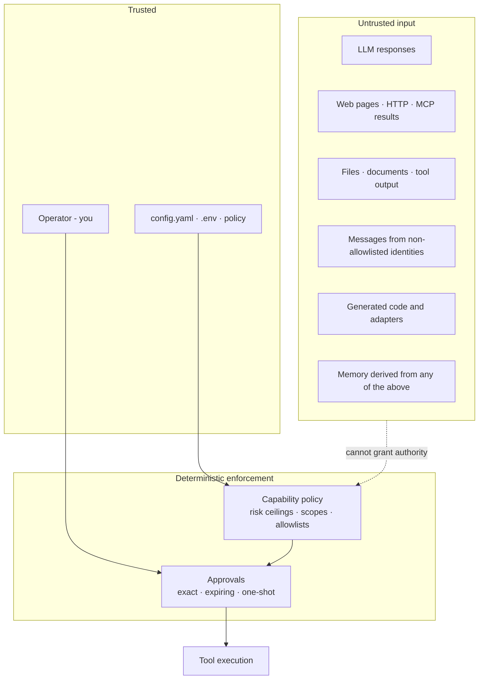

# Threat Model

YBM is a **single-operator, local** agent-control system. The supported deployment is one trusted
operator, loopback-bound services, and an OS account that protects local config and runtime data.
Internet exposure, untrusted local users, and multi-tenancy are out of scope.

This describes what's implemented. It is not a claim that model output or external content can be
made trustworthy.

## Trust boundary

The operator and local configuration are trusted. Everything crossing the dashed line is
**untrusted data, even when it looks like an instruction.**

An enabled tool is not a trusted tool. Its result may be malicious, stale, malformed, or
controlled by someone else.

## Security invariants

Enforcement is deterministic - the model participates in none of it.

1. The **runtime tool definition** owns each tool's capability and minimum operation risk. A model
   cannot substitute a lower-risk capability or understate an operation's risk.
2. A capability must be **enabled**, in **scope**, and at or below its **risk ceiling**.
3. The **global approval floor** stays authoritative even when a capability's `requires_approval`
   is false.
4. Persistent and critical operations require approval **independently of any access-mode preset**
   - MCP server installation, generated-adapter promotion, active desktop/browser control,
   generated or unsandboxed code execution, and HTTP requests carrying vault secrets.
5. An approval is bound to one task, tool, capability, validated input, scope, risk, timeout, and
   approval requirement. It **expires** and is **atomically consumed** before a single dispatch.
   Changing any parameter or replaying it fails closed.
6. Access modes configure availability. They **do not grant or fabricate approvals** - including
   "Full Access".

Defaults keep terminal, filesystem writes, browser/desktop control, dependency installs, and Git
push disabled. Network requests require explicit host allowlisting.

## Principal threats

| Threat | What limits it | What it does *not* do |
|---|---|---|
| **Indirect prompt injection** - untrusted content redirects the model | Runtime-owned capabilities, risk levels, scopes, approvals bound the blast radius; content labeled `operation_content_trust` is fenced and labeled data-not-instruction in the Operator prompt itself | Does not make injected content safe, or guarantee the model ignores it |
| **Memory poisoning** - tool output persists into later context | Treat recalled content as untrusted; clear conversation state after processing known-bad content | Provenance tracking and automated poisoning detection remain open work |
| **Excessive agency** | Capability policy, operation risk, bounded retries/steps, exact approvals, kill switch | You remain responsible for approving the exact operation shown |
| **Generated / unsandboxed code** | Docker is the preferred boundary when enabled; local-subprocess fallback runs with the YBM account's authority and therefore requires approval | Docker is defense in depth, **not** equivalent to a separate host or VM |
| **MCP servers and generated adapters** | Both need an exact one-shot approval; review package, command, env vars, declared risks, and generated files first | Use a separate OS account or VM for anything untrusted |
| **Secret disclosure** | Secrets enter via env vars or vault refs; vault-secret HTTP calls need approval; CI scans full history with Gitleaks | Redaction is a safeguard, **not** a substitute for keeping secrets out of prompts and output |
| **Local control-plane exposure** | Services bind loopback by default; the admin API refuses cross-origin requests and fails closed if bound non-loopback without a token | Not hardened as a public or multi-user API |
| **Supply chain** | Actions pinned to commit SHAs, lockfiles committed, dependency audit in CI | Updates are reviewed manually |

Do not treat "Full Access" as a safe mode for browsing or processing untrusted content.

## Keep private

`.env`, `config/config.yaml`, `.agent_control/agent_control.db`, logs, screenshots, generated workspaces, and
everything under `.agent_control/`.

A Gitleaks finding requires **credential revocation and history cleanup** - not just deleting the
current file.

## Before making the repo public

- [ ] Add an explicit open-source license
- [ ] Run the full deterministic test and quality suites
- [ ] Full-history secret scan; revoke and rewrite any finding
- [ ] Review tracked files and release artifacts for private data
- [ ] Resolve failing dependency-update PRs
- [ ] Enable private vulnerability reporting
- [ ] Protect `main` with required review and CI
- [ ] Restrict branch deletion and force pushes

Visibility must not change as a side effect of this checklist - it takes an explicit decision by
the owner.

## References

- [OWASP Top 10 for Agentic Applications](https://genai.owasp.org/resource/owasp-top-10-for-agentic-applications-for-2026/)
- [OWASP AI Agent Security Cheat Sheet](https://cheatsheetseries.owasp.org/cheatsheets/AI_Agent_Security_Cheat_Sheet.html)
- [Security hardening for GitHub Actions](https://docs.github.com/en/actions/security-for-github-actions/security-guides/security-hardening-for-github-actions)
