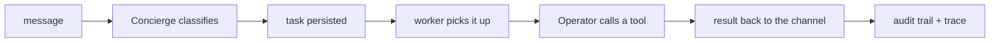

# Using YBM

What you see after it starts, what each page is for, and how to check that it is working. To get it
running in the first place, see [INSTALL.md](INSTALL.md).

## Your first ten minutes

1. **It starts and signs you in.** The launcher creates your config and admin token, picks a model from
   what is already on the machine (your own LocalDeploy, a running Ollama, or a provider key in your
   environment or `.env`; it never calls a paid API to choose), and opens the console already signed in.
   The model it chose is named in the launcher output and in the chat header.
2. **If no model was found,** a short wizard offers a local model or a cloud provider, verifies access,
   and makes one small completion before saving. Skipping it leaves chat unavailable until you configure
   a model under **Settings**.
3. **Choose folders.** File access is off on a fresh install. Chat offers a card with your Downloads,
   Documents, Desktop, and Pictures folders: pick the ones YBM may work in, choose **Read-only** or
   **Write with approval**, and it takes effect on the next task with no restart. It will not grant a
   whole drive, your home folder, or an operating-system folder.
4. **Try a starter.** Chat suggests three: "Organize my Downloads folder by type", "Summarize the PDFs on
   my desktop", and "Find the largest files filling up my disk". The first deliberately stops for an
   approval so you meet the approval gate straight away: it shows what it intends to move, and nothing
   moves until you approve.
5. **Read the receipt.** When a task finishes, the chat card lists what it touched, what ran, what left
   the machine, and what it is unsure of. **Tasks** keeps the full trace.

If a task needs something that is switched off, it says which switch to flip (for example "Turn on
Browser") and offers a button, instead of failing with a code.

## The console

| Page | What it is for |
|---|---|
| **Chat** | Talk to YBM. A question gets a direct reply; a request becomes a task shown inline with its approvals and receipt. Slash commands are not used here; plain `approve`, `status`, and `remember that ...` work. |
| **Tasks** | Every task, with filters and a detailed trace per task: each tool call, its result, approvals, the model calls and their cost, and timing. Completed tasks can be replayed or saved as a workflow. |
| **Insights** | How often work actually finishes *verified*, not just how often the model said it did: success rates by tool, which tools have no mechanical check yet, cost and duration. |
| **Access** | What YBM can observe, what needs your review, and what may run on its own, grouped into Off, Read-only, Write with approval, and Full access. Runtime approval gates still apply to critical operations. **Security review** (linked from here) shows what the machine is exposed to right now, from configuration and recorded activity rather than a live scan. |
| **Agent** | What YBM is made of. **Memory**: durable facts it remembers, with where each came from; correct or delete any of them. **Skills**: instructions it reads when relevant (a runbook, a style guide); a skill cannot execute anything. **Tools**: the tool catalog and the capability each needs. **Workflows**: completed tasks saved as named, reusable plans; running one goes through the same approval and verification checks as any task. |
| **Settings** | The model (including a one-message test), per-role models, Telegram, MCP servers, computer use, voice, the VS Code bridge, the workspace, diagnostics, and the audit log. WhatsApp is configured in `config/config.yaml`, not here; see [INSTALL.md](INSTALL.md#link-whatsapp). |

The status strip in the header shows the model, Telegram, VS Code, workspace, and database at a glance.

## Approvals

Anything consequential stops and asks, showing what it will do before it does it. An approval belongs to
one task, one tool, and one exact request; it expires, and it is used once. Changing the request or
replaying the approval fails closed. When a task needs several approvals for related changes it asks
once with the whole list. Approve in the console, or on Telegram with the inline buttons or by replying
`approve`. An approval nobody answers expires, and the task is marked blocked rather than waiting
forever.

Access modes control availability, never approvals: even **Full access** does not skip the approvals a
tool declares for risky operations such as installing an MCP server, promoting generated code, or running
generated Python. See [CAPABILITIES.md](CAPABILITIES.md) and the [threat model](THREAT_MODEL.md).

## Check that the whole chain works

This proves intake, classification, persistence, the worker, tool execution, the audit trail, and result
delivery are all connected. It needs a working model and nothing else.

1. Start YBM and open the console (the launcher does both).
2. In **Settings**, press **Send a test message to the current model**. It must pass; all text is
   classified by it.
3. In **Chat**, ask `what can you do?`. It answers directly and creates no task.
4. Ask `what tasks are running right now?`. It creates a task that calls `task.status` and replies.
5. Confirm: **Tasks** shows it reaching `completed`; `ybm trace-task <task_id>` (Windows wrapper:
   `.\scripts\ybm.ps1 trace <task_id>`) lists the tool call and its result; **Settings -> Audit** shows
   the classification and task-created events.

For a task that produces files, grant a folder first (above) and try
`create a hello world web app and launch it`. Expect a localhost preview URL plus files under
`.agent_control/workspaces/task_<id>`. The Operator chooses its own tool sequence each run, so judge the
result, not the route.

### Telegram

Telegram adds real channel intake. You need a BotFather token and your Telegram user ID and chat ID.

1. Add `TELEGRAM_BOT_TOKEN=...` to `.env`, or paste the token in the **Telegram** card under Settings,
   which verifies it before saving.
2. Enable Telegram, add your user ID and chat ID to the allowlist, and save. An empty allowlist denies
   every message.
3. Restart YBM so the Telegram intake process starts.
4. Send `what tasks are running right now?` to your bot, then `/tasks`.
5. Confirm the reply comes back in the same chat and **Tasks** shows the task completing.

## If something stalls

Commands here use the `ybm` CLI; [INSTALL.md](INSTALL.md#runtime-interfaces) gives the exact path or
Windows wrapper command for your install.

| Symptom | Check |
|---|---|
| Message ignored | The allowlist. An empty one denies everything. |
| Chat says no model is configured | Settings, **Model**. Add a local endpoint or an API key. |
| Task stuck in `received` | Is the worker running? `ybm status` (Windows wrapper: `.\scripts\ybm.ps1 status`). |
| Task `awaiting_approval` | Approve it in the console, or on Telegram. |
| Tool "denied" or "blocked" | The capability is off. Follow the card in chat, or see Access and [CAPABILITIES.md](CAPABILITIES.md). |
| The console asks for a token | Run the launcher again (it opens a signed-in console), or `ybm admin-url` for a link, or copy `AGENT_ADMIN_TOKEN` from `.env`. |
| Anything else | `ybm trace-task <task_id>` and `ybm logs worker --follow`, then `ybm doctor`. |

`ybm doctor` checks the runtime, ports, model, and the capability configuration and says what to fix.
Stop everything with `ybm stop` (or `run.bat stop` / `./run.sh stop` from a checkout).
